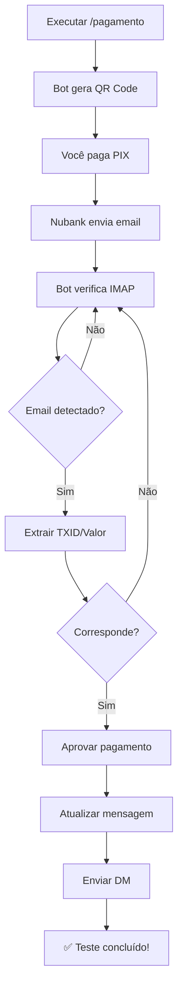

# 🧪 Testar Nubank IMAP no Discord

## ✅ Pré-requisitos

Antes de testar, certifique-se de que:

1. ✅ **Nubank IMAP está configurado** no painel (`/panel` → Configurações → Pagamentos)
2. ✅ **Status está "Ativado"** (verde)
3. ✅ **Senha de app está correta** (teste com: `python functions/payments/test_imap_quick.py`)
4. ✅ **Notificações por email** estão ativas no app Nubank

---

## 🚀 Como Testar

### 1️⃣ Criar um Pagamento de Teste

No Discord, execute o comando:

```
/pagamento
```

**Parâmetros:**
- **metodo:** `Nubank IMAP`
- **valor:** `0.01` (R$ 0,01 para teste)
- **usuario:** Selecione você mesmo (ou outro membro)
- **descricao:** `Teste de pagamento Nubank IMAP`

### 2️⃣ O Que Acontece

1. **Bot gera QR Code PIX** com TXID único
2. **Mensagem aparece** com:
   - 🖼️ QR Code para escanear
   - 📋 Código PIX (Copiar e Colar)
   - 💰 Valor: R$ 0,01
   - 👤 Usuário selecionado

### 3️⃣ Pagar o PIX

**Opção 1: Escanear QR Code**
- Abra seu app bancário
- Escaneie o QR Code da mensagem
- Confirme o pagamento de R$ 0,01

**Opção 2: Copia e Cola**
- Clique no botão **"Copiar código"**
- Abra seu app bancário
- Vá em PIX → Copia e Cola
- Cole o código
- Confirme o pagamento

### 4️⃣ Aguardar Aprovação Automática

⏱️ **Tempo estimado:** 30 a 120 segundos

O bot irá:
1. ✅ Aguardar email do Nubank com notificação de PIX recebido
2. ✅ Verificar IMAP a cada 10 segundos
3. ✅ Extrair TXID e valor do email
4. ✅ Comparar com o pagamento pendente
5. ✅ **Aprovar automaticamente** quando corresponder
6. ✅ Atualizar a mensagem para **"Status: ✅ Aprovado"**
7. ✅ Enviar DM para o usuário confirmando

### 5️⃣ Verificação de Sucesso

Quando aprovado, você verá:

**Na mensagem do pagamento:**
- ✅ Embed fica **verde**
- ✅ Campo **"Status: ✅ Aprovado"** aparece
- ✅ QR Code some
- ✅ Botões são removidos

**Na DM do usuário:**
- ✅ Recebe notificação de pagamento aprovado
- ✅ Link para voltar à mensagem

---

## 📊 Monitoramento em Tempo Real

### Ver Logs do Bot

No terminal do bot, você verá:

```
📋 Dados do pagamento nubank_imap:
  - Keys disponíveis: ['payment_id', 'cart_id', 'status', 'amount', ...]
  - checkout_url: None
  - copy_code: 00020126580014br.gov.bcb.pix...
  - qr_bytes: 2048 bytes
  - qr_url: None

✅ Pagamento PIX detectado: {'amount': 0.01, 'txid': 'CART123456...', 'payer_name': 'Seu Nome'}
✅ Pagamento aprovado automaticamente: CART123456...
```

### Verificar Manualmente

Execute no terminal:

```powershell
cd "C:\Users\souza\OneDrive\Documentos\Sync Projects\bot-2"
python -c "from functions.database import database as db; print(db.get_document('nubank_pending_payments'))"
```

---

## 🔍 Troubleshooting

### ❌ Erro: "Nubank IMAP não está habilitado"

**Solução:**
1. Execute `/panel` no Discord
2. Configurações → Formas de Pagamento
3. Selecione "Nubank IMAP"
4. Mude Status para **"Ativado"**
5. Enviar

### ❌ Erro: "Email não configurado no Nubank IMAP"

**Solução:**
1. Volte ao painel de pagamentos
2. Configure todos os campos obrigatórios
3. Teste a conexão: `python functions/payments/test_imap_quick.py`

### ❌ Pagamento não é aprovado automaticamente

**Causas possíveis:**

1. **Email ainda não chegou**
   - ⏳ Aguarde até 2 minutos
   - 📧 Verifique se o email chegou no Gmail

2. **Notificações desativadas**
   - 📱 Abra o app Nubank
   - 🔔 Vá em Notificações → Configurações
   - ✅ Ative "Receber notificações por email"

3. **Senha IMAP incorreta**
   - 🔑 Teste: `python functions/payments/test_imap_quick.py`
   - Se falhar, regenere a senha de app

4. **TXID não foi capturado**
   - 📝 Verifique os logs do bot
   - 🔍 Procure por "Pagamento PIX detectado"

### ❌ QR Code não aparece

**Solução:**
- Verifique se `QRCodeGenerator` está funcionando
- O sistema usa fallback automático se houver erro

---

## 📝 Exemplo de Teste Completo

```
PASSO 1: Criar pagamento
/pagamento metodo:Nubank IMAP valor:0.01 usuario:@você descricao:Teste

PASSO 2: Aguardar mensagem
[Bot envia mensagem com QR Code e código PIX]

PASSO 3: Pagar PIX
[Você paga R$ 0,01 pelo app do banco]

PASSO 4: Aguardar email Nubank
⏳ Nubank envia email: "Você recebeu R$ 0,01"

PASSO 5: Bot monitora IMAP
🔄 Bot verifica emails a cada 10 segundos

PASSO 6: Bot detecta pagamento
✅ "Pagamento PIX detectado: {'amount': 0.01, ...}"

PASSO 7: Bot aprova automaticamente
✅ "Pagamento aprovado automaticamente: CART..."

PASSO 8: Mensagem atualizada
✅ Status muda para "Aprovado" (verde)

PASSO 9: DM enviada
✅ Você recebe notificação no privado
```

---

## 🎯 Dados de Teste

### Valores Recomendados

| Valor | Uso | Motivo |
|-------|-----|--------|
| **R$ 0,01** | ✅ Teste inicial | Valor mínimo, fácil de reverter |
| **R$ 1,00** | ✅ Teste real | Valor real mínimo |
| **R$ 5,00** | ✅ Teste completo | Valor típico de produtos |

### Cart IDs Gerados

O sistema gera automaticamente:
```
CART{user_id}{timestamp}
```

Exemplo: `CART123456789012345671699999999`

Este ID é usado como **TXID** no PIX para rastreamento.

---

## 🔄 Fluxo Completo de Teste



---

## 📈 Métricas de Sucesso

Após o teste, verifique:

- ✅ **QR Code gerado** corretamente
- ✅ **Código PIX** válido e funcionando
- ✅ **Email do Nubank** foi recebido
- ✅ **Bot detectou** o pagamento
- ✅ **Aprovação automática** funcionou
- ✅ **Mensagem atualizada** para "Aprovado"
- ✅ **DM enviada** para o usuário
- ✅ **Tempo total** < 2 minutos

---

## 🎉 Teste Bem-Sucedido!

Se tudo funcionou:

1. ✅ **Nubank IMAP está operacional**
2. ✅ **Aprovação automática funcionando**
3. ✅ **Sistema pronto para produção**

**Próximos passos:**
- 🚀 Use em vendas reais
- 📊 Monitore os logs
- 💰 Configure valores reais
- 🔄 Teste com múltiplos usuários

---

## 🆘 Suporte

Se o teste falhar:

1. **Verifique logs:** Terminal do bot
2. **Teste IMAP:** `python functions/payments/test_imap_quick.py`
3. **Veja configuração:** `/panel` → Pagamentos → Nubank IMAP
4. **Regenere senha:** https://myaccount.google.com/apppasswords

---

**✨ Boa sorte com o teste! O sistema está pronto para receber pagamentos automaticamente! 🚀**

